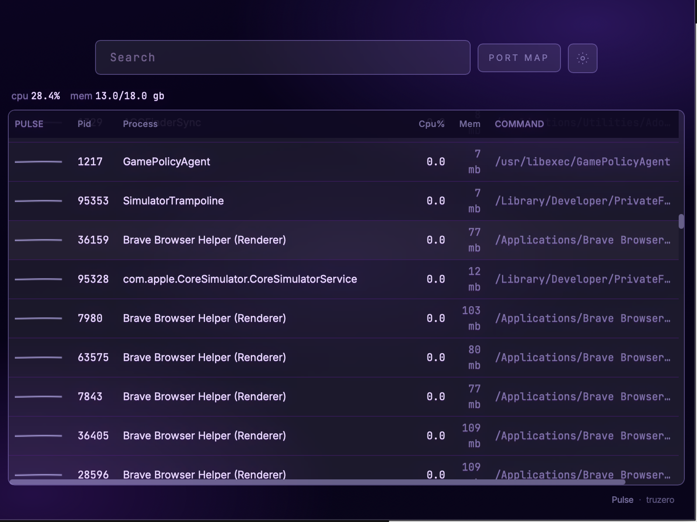
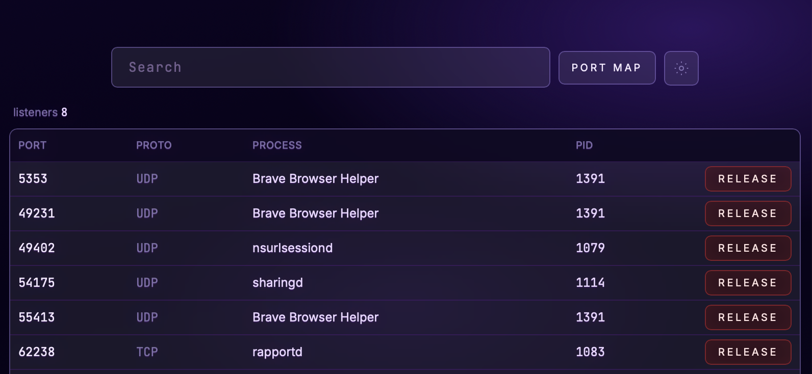
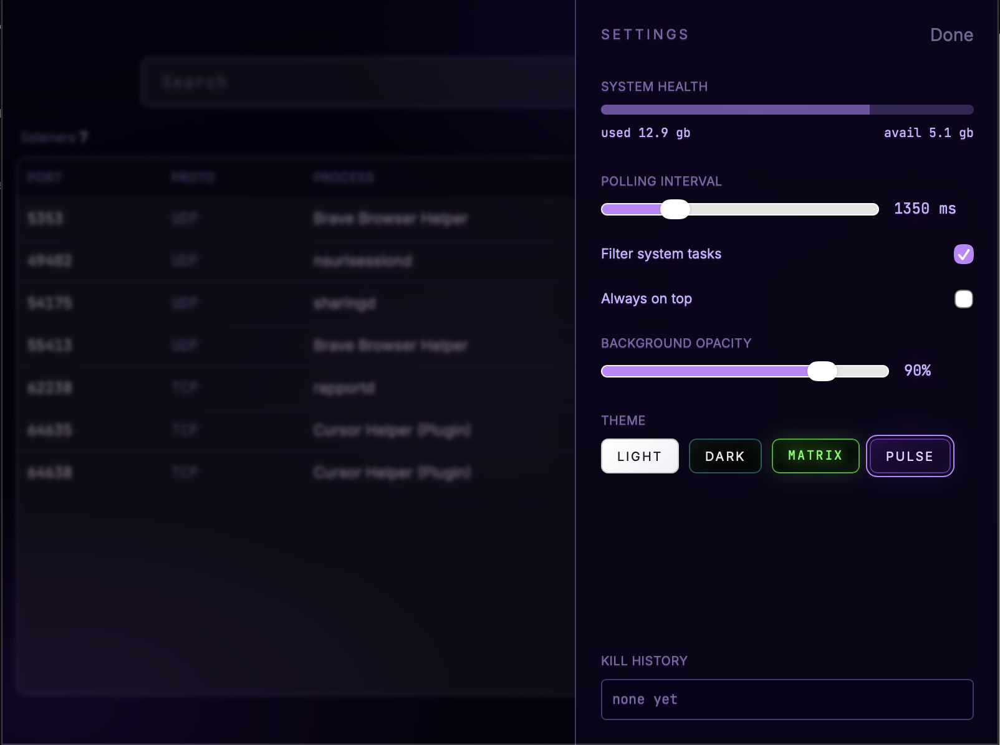

<div align="center">


# truzero // pulse

<p align="center"><strong>process & listener intelligence for macOS</strong><br/>
Repository: <code>truzero/pulse</code></p>

**A high-performance, developer-centric process & port manager** built with **Rust** and **Tauri**.

[](https://github.com/truzero/pulse)
[](./LICENSE)
[](https://www.rust-lang.org/)
[](https://tauri.app/)

[Architecture](./architecture.md) · [Roadmap](./architecture.md#roadmap)

### Screenshots

<p align="center">
  <strong>Process list</strong><br/>
  <br/><br/>
  <strong>Port map</strong><br/>
  <br/><br/>
  <strong>Settings</strong><br/>
  
</p>

</div>

---

## Why Pulse Exists

Modern development stacks leak **implicit state**: orphan services, duplicated listeners, zombie build tools, and ports that “should be free” but are not. Pulse turns that chaos into **clarity**—fast list views, decisive actions, and a mental model that matches how you already work.

## System Intelligence

Pulse is not another static process list. **System Intelligence** is the product layer that:

- **Resolves conflicts** by correlating listeners, PIDs, and bind addresses before you ship a fix.
- **Explains ownership** (“what actually holds this port?”) with OS-accurate evidence, not guesses.
- **Surfaces risk** with human-readable signals (duplicates, unsafe kills, privileged listeners) instead of silent failures.
- **Stays local**: diagnostics are computed on-device; no telemetry exfiltration by design.

This is the spine of Pulse: credible answers under load, tuned for developer workflows rather than enterprise dashboards.

## Principles

| Principle | What it means |
|-----------|----------------|
| **Fast by default** | Rust-native operations; UI stays responsive under churn. |
| **Least surprise** | Destructive actions are explicit, confirmed, and reversible where possible. |
| **Feature-first layout** | UI domains live in `src/features/*` for predictable navigation. |

## Repository Layout (initial)

```
src/features/
├── process-runtime/       # Lifecycle, signals, grouping
├── port-registry/         # Listeners, bindings, conflicts
├── system-intelligence/   # Heuristics, summaries, anomaly hints
└── ui-shell/              # Cross-feature shell and command surface
```

Rust and Tauri scaffolding lands in `src-tauri/` as the implementation hardens.

## Development

**Requirements:** Rust (stable), Node 20+. macOS recommended for Finder integration and vibrancy (`com.truzero.pulse`).

```bash
npm install
npm run tauri dev        # desktop shell + Vite HMR
npm run tauri build      # release bundle
```

Rust backend and IPC live in [`src-tauri/`](./src-tauri/). React UI lives under [`src/`](./src/) with feature slices (`process-runtime`, `ui-shell`). Snapshots validate with **Zod** before render.

Contributions should follow [`architecture.md`](./architecture.md): feature-first layout, strict typing, and the **200-line** file budget per module.

## License

MIT — see [`LICENSE`](./LICENSE).
